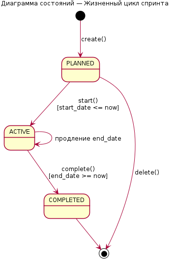

\newpage

# ВВЕДЕНИЕ

Современные процессы разработки программного обеспечения и управления проектами невозможно представить без специализированных систем управления задачами (Issue Tracking Systems, ITS). Такие системы выступают центральным узлом командной работы: в них фиксируются требования, декомпозируются крупные единицы работы, отслеживается прогресс, ведутся обсуждения и хранится история изменений каждой задачи. Согласно отчёту State of Agile, более 80 % команд, использующих гибкие методологии, ежедневно работают с инструментами вида Jira, Asana, Trello, YouTrack или GitLab Issues, а сам рынок SaaS-решений для управления задачами устойчиво растёт двузначными темпами.

На фоне ухода ряда зарубежных вендоров с российского рынка особое значение приобретают **импортозамещающие** решения — системы, разворачиваемые в собственной инфраструктуре или у российских облачных провайдеров. Это требование ставит перед разработчиком задачу спроектировать архитектуру, которая будет одновременно: (а) изолировать данные множества организаций (multi-tenancy), (б) поддерживать гибкие методологии (Kanban, Scrum), (в) обеспечивать прозрачную работу с биллингом, безопасность аутентификации и горизонтальное масштабирование.

**Объектом исследования** настоящей курсовой работы является процесс совместной разработки программного обеспечения, организованный в виде потока задач между ролями.
**Предметом исследования** — методы и средства проектирования и реализации многоарендной (multi-tenant) системы управления задачами на основе современного стека технологий (NestJS, React, PostgreSQL, Redis, S3-совместимое объектное хранилище).

**Целью** работы является разработка прототипа системы управления задачами «TaskHub», функционально близкой к Jira, и подготовка для него полного комплекта UML-диаграмм согласно нотации UML 2.5.

Для достижения поставленной цели сформулированы следующие **задачи**:

1. Провести анализ предметной области и существующих решений в классе Issue Tracking Systems.
2. Сформировать функциональные и нефункциональные требования к прототипу, выделить роли и сценарии использования.
3. Спроектировать архитектуру системы: модульный монолит на NestJS, фронтенд-SPA на React, реляционную базу данных PostgreSQL с поддержкой Row-Level Security.
4. Разработать модель предметной области и физическую схему БД с учётом изоляции арендаторов.
5. Реализовать ключевые подсистемы: аутентификацию (JWT с ротацией refresh-токенов), управление задачами с Kanban-доской, спринты, комментарии, вложения, уведомления реального времени.
6. Подготовить полный комплект UML-диаграмм: диаграмма вариантов использования, классов, ER-диаграмма, диаграммы последовательности, активности, состояний, компонентов, развёртывания и пакетов.
7. Описать инфраструктуру развёртывания на базе Docker Compose и обратного прокси Traefik.
8. Сформулировать выводы о применимости разработанного прототипа и наметить направления его развития.

**Методы исследования.** В работе использованы методы системного и структурного анализа, объектно-ориентированного проектирования, моделирования с использованием унифицированного языка моделирования UML, реляционной алгебры (для проектирования БД), а также методы программной инженерии (Domain-Driven Design, layered architecture, dependency injection).

**Практическая значимость.** Полученный прототип может использоваться как основа для создания корпоративной системы управления задачами, а также как методический материал по проектированию многоарендных SaaS-приложений.

**Структура работы.** Работа состоит из введения, двух глав, заключения, списка использованных источников и приложений с UML-диаграммами. Объём основного текста — около 30 страниц.

\newpage

# ГЛАВА 1. АНАЛИЗ ПРЕДМЕТНОЙ ОБЛАСТИ И ПРОЕКТИРОВАНИЕ СИСТЕМЫ

## 1.1 Системы управления задачами как класс программного обеспечения

Под системой управления задачами (Issue Tracking System) понимается информационная система, обеспечивающая централизованный учёт единиц работы (задач, требований, дефектов) на всём их жизненном цикле — от создания до закрытия. Ключевая абстракция таких систем — **issue** (задача, тикет): объект с уникальным идентификатором, ответственным, статусом, приоритетом, комментариями и историей изменений.

В современной практике выделяются три обобщённые группы систем данного класса:

1. **Корпоративные SaaS-решения** — Atlassian Jira Cloud, Asana, Monday, Linear. Отличаются богатой функциональностью и закрытым исходным кодом, размещаются на стороне поставщика.
2. **Self-hosted продукты** — Jira Data Center, GitLab Issues, Redmine, YouTrack Server. Разворачиваются в инфраструктуре клиента, что критично для корпоративной информационной безопасности.
3. **Open source-решения** — OpenProject, Taiga, Kanboard. Лицензированы под свободными лицензиями (MIT, GPL), допускают модификацию под нужды организации.

Сравнительный анализ показывает, что наиболее востребованной моделью на корпоративном рынке является **multi-tenant SaaS** с возможностью выкатки on-premise. Именно эта архитектура позволяет одновременно обслуживать множество организаций (арендаторов, tenants) на едином программном и инфраструктурном стеке, обеспечивая при этом **строгую логическую изоляцию** их данных.

Анализ функциональности промышленных систем (Jira, GitLab, Linear, YouTrack) позволил выделить следующее **ядро функций**, обязательных для любой современной ITS:

- управление организациями, пользователями и ролями;
- управление проектами, в том числе настраиваемыми досками (Kanban / Scrum);
- управление спринтами (бэклог, активный спринт, завершённый спринт);
- управление задачами: создание, редактирование, перемещение по статусам, иерархия «подзадача — родительская задача»;
- комментарии и вложения файлов;
- история изменений (changelog) каждой задачи;
- метки (labels) и приоритеты;
- полнотекстовый поиск по задачам;
- уведомления в реальном времени (in-app + e-mail);
- ролевая модель доступа (RBAC);
- учёт планов подписки и платежей.

Прототип, разработанный в рамках настоящей работы, носит наименование **TaskHub** и реализует все перечисленные функции.

## 1.2 Функциональные и нефункциональные требования

### 1.2.1 Роли пользователей

В системе предусмотрена иерархия из четырёх ролей с возрастающими полномочиями:

- **VIEWER** — наблюдатель, только чтение;
- **DEVELOPER** — может создавать и обновлять собственные задачи, оставлять комментарии;
- **PROJECT_MANAGER** — создаёт проекты, спринты, управляет задачами в проекте, конфигурирует доски;
- **ADMIN** — полный административный доступ: пользователи, биллинг, настройки арендатора.

Кроме того, выделяются **внешние акторы**: незарегистрированный посетитель (Guest), платёжный шлюз ЮKassa и SMTP-сервер. Полный набор сценариев приведён на диаграмме вариантов использования (Приложение А, рисунок А.1).

### 1.2.2 Функциональные требования

Сформулированы 24 ключевых функциональных требования, сгруппированных по подсистемам (таблица 1).

**Таблица 1 — Перечень функциональных требований TaskHub**

| №   | Подсистема         | Краткая формулировка требования                                              |
|-----|--------------------|------------------------------------------------------------------------------|
| Ф1  | Регистрация        | Регистрация новой организации с автоматическим созданием администратора     |
| Ф2  | Аутентификация     | Вход по email/паролю, выдача access- и refresh-токенов JWT                   |
| Ф3  | Аутентификация     | Ротация refresh-токенов с детектированием повторного использования          |
| Ф4  | Аутентификация     | Безопасный выход с инвалидацией refresh-токена в Redis                      |
| Ф5  | Пользователи       | Просмотр и редактирование собственного профиля, смена аватара               |
| Ф6  | Пользователи       | Управление участниками организации (приглашения, изменение ролей)            |
| Ф7  | Проекты            | CRUD-операции над проектами, выбор типа доски (KANBAN/SCRUM)                |
| Ф8  | Проекты            | Управление колонками доски (создание, переименование, удаление, порядок)    |
| Ф9  | Спринты            | Создание, запуск, завершение спринта, привязка задач                        |
| Ф10 | Задачи             | Создание задачи с указанием приоритета, исполнителя, родительской задачи    |
| Ф11 | Задачи             | Изменение статуса, приоритета, исполнителя, оценки в Story Points           |
| Ф12 | Задачи             | Перемещение задачи на доске с float-упорядочением и ребалансировкой         |
| Ф13 | Задачи             | Иерархия «родительская задача — подзадача»                                  |
| Ф14 | Задачи             | Курсорная пагинация при выборке списка задач                                |
| Ф15 | Комментарии        | Добавление и просмотр комментариев к задаче                                 |
| Ф16 | Вложения           | Загрузка файлов через presigned-URL в S3-совместимое хранилище              |
| Ф17 | Журналы            | Запись в changelog при изменении ключевых полей                             |
| Ф18 | Метки              | Создание меток арендатора, привязка нескольких меток к задаче               |
| Ф19 | Поиск              | Полнотекстовый поиск по задачам с поддержкой русской морфологии              |
| Ф20 | Уведомления        | Создание уведомления при назначении задачи, обновлении, новом комментарии   |
| Ф21 | Уведомления        | Доставка уведомлений через WebSocket и e-mail                               |
| Ф22 | Биллинг            | Платежи через ЮKassa с подтверждением через webhook                         |
| Ф23 | Биллинг            | Контроль лимитов плана (PlanGuard) при создании пользователей и задач        |
| Ф24 | Мониторинг         | Health-check эндпойнт, проверяющий БД и Redis                                |

### 1.2.3 Нефункциональные требования

К нефункциональным требованиям прототипа отнесены:

- **Изоляция данных**: ни при каких условиях запрос пользователя одного арендатора не должен возвращать данные другого арендатора. Реализация — Row-Level Security PostgreSQL.
- **Производительность**: время ответа REST-API при типовой нагрузке — не более 200 мс P95.
- **Масштабируемость**: stateless-сервер приложения (sessions хранятся в Redis), горизонтальное масштабирование за обратным прокси.
- **Безопасность**: пароли хранятся в виде хэшей bcrypt с настраиваемым cost; токены подписываются HMAC-SHA256.
- **Сопровождаемость**: модульный монолит, строгая типизация TypeScript, автоматизированная валидация входных данных через Zod и `class-validator`.
- **Локализация**: интерфейс и поиск поддерживают русский и английский языки.

## 1.3 Архитектура системы

### 1.3.1 Стиль архитектуры

В качестве стиля архитектуры выбран **модульный монолит** с явным разделением на слои:
- слой представления (HTTP-контроллеры, WebSocket-шлюзы);
- слой бизнес-логики (сервисы);
- слой доступа к данным (TypeORM-репозитории и сущности);
- инфраструктурный слой (Redis, MinIO, SMTP, JWT, EventEmitter).

Такой выбор обусловлен компромиссом между сложностью разработки и поддержкой: микросервисная архитектура для прототипа избыточна, а монолитный подход в чистом виде ведёт к высокой связности кода. Модульный монолит, реализуемый средствами фреймворка NestJS, даёт возможность в дальнейшем выделить любой модуль в отдельный микросервис без переписывания.

### 1.3.2 Технологический стек

**Backend** — NestJS 10 поверх Node.js 20. Преимущества: декларативный DI-контейнер; декораторы для контроллеров, guards, pipes; встроенная поддержка WebSocket; модульная организация. ORM — TypeORM с явной декларацией сущностей и миграций.

**Frontend** — React 18 в связке со сборщиком Vite 5; маршрутизация — React Router v6 с lazy-загрузкой страниц; глобальное состояние — Zustand; запросы к API — нативный `fetch` через тонкую обёртку с автоматической подстановкой access-токена.

**Хранилище данных** — PostgreSQL 16 с расширениями `uuid-ossp` (генерация UUIDv4) и `pg_trgm` (триграммный поиск). Для индексации полнотекстовой выборки используется `tsvector` с поддержкой русской и английской морфологии. Для кэша и хранения refresh-токенов — Redis 7. Для файловых вложений — MinIO (совместимый с протоколом Amazon S3).

**Инфраструктура** — Docker Compose, обратный прокси Traefik 3, реализующий маршрутизацию по subdomain (`acme.app.localhost`, `api.app.localhost` и т. д.). Развёртывание описано в подразделе 2.7 и проиллюстрировано на диаграмме развёртывания (Приложение А, рисунок А.11).

### 1.3.3 Архитектурные решения

Принципиальные решения, заложенные в архитектуру TaskHub, представлены ниже.

**1. Multi-tenant с использованием Row-Level Security.** Каждая запись в таблицах `users`, `projects`, `issues`, `notifications` и т. д. содержит столбец `tenant_id`. Перед выполнением запросов middleware устанавливает `SET LOCAL app.tenant_id = '<uuid>'`, после чего политики RLS обеспечивают, что таблица «видит» только строки текущего арендатора. Этот приём (так называемая *single database, shared schema*-модель) позволяет совмещать высокую плотность размещения с гарантией изоляции на уровне СУБД.

**2. Event-driven подход к побочным эффектам.** Сервисы предметной области не вызывают друг друга напрямую. Вместо этого они публикуют события через `@nestjs/event-emitter` (например, `issue.created`, `issue.assigned`, `comment.added`). Подписчиками выступают модули `Notifications` (создание in-app уведомлений и WebSocket-broadcast), `Mail` (отправка писем), `Issues.Gateway` (трансляция WS-событий клиентам). Это позволяет добавлять новые реакции на события без модификации основной бизнес-логики (соблюдение принципа Open/Closed).

**3. JWT с ротацией refresh-токенов.** Access-токен — короткоживущий (15 минут), хранится в памяти SPA. Refresh-токен — долгоживущий (7 дней), хранится в Redis в виде «активный → отпечаток». При обновлении пары токенов старый refresh-токен немедленно инвалидируется; повторное обращение с тем же refresh-токеном расценивается как компрометация и приводит к глобальному отзыву всей сессии пользователя. Этот механизм описан в RFC 6819 как *refresh token reuse detection*.

**4. Float-упорядочивание задач на Kanban-доске.** Чтобы избежать пересохранения всех задач в колонке при перетаскивании одной из них, поле `order` имеет тип `DOUBLE PRECISION`. Новой позиции присваивается среднее арифметическое порядков соседних задач. При исчерпании числовой точности запускается процедура **ребалансировки** — все задачи в колонке получают новые равномерно распределённые значения. Подробное описание алгоритма приведено в подразделе 2.3.

**5. Курсорная пагинация.** Для больших списков задач API возвращает не порядковую страницу, а курсор (закодированную пару `(updated_at, id)`). Это устраняет проблему «скачка строк» при добавлении или изменении задач между обращениями клиента.

**6. Presigned URL для загрузки файлов.** Сервер не выступает прокси для бинарных потоков: он лишь подписывает URL для прямой загрузки в MinIO, что разгружает Node.js-процесс и позволяет масштабировать загрузку независимо от API.

## 1.4 Модель предметной области

Модель предметной области, изображённая на диаграмме классов (Приложение А, рисунок А.2), включает 11 сущностей, объединённых в три кластера:

1. **Арендатор и пользователи**: `Tenant`, `User`.
2. **Структура работы**: `Project`, `BoardColumn`, `Sprint`, `Issue`, `Label`.
3. **Активность вокруг задачи**: `IssueComment`, `IssueAttachment`, `IssueChangelog`, `Notification`.

Перечислим основные ассоциации:

- `Tenant 1 — N User` (агрегация);
- `Tenant 1 — N Project`, `Tenant 1 — N Label`, `Tenant 1 — N Notification` (композиция, каскадное удаление);
- `Project 1 — N BoardColumn` и `Project 1 — N Sprint`;
- `Project 1 — N Issue`;
- `Sprint 0..1 — N Issue` (задача может находиться в бэклоге, тогда `sprint_id IS NULL`);
- `Issue 0..1 — N Issue` (рекурсивная самоассоциация «родительская задача»);
- `User 1 — N Issue` как `reporter` и `User 0..1 — N Issue` как `assignee`;
- `Issue 1 — N IssueComment`, `Issue 1 — N IssueAttachment`, `Issue 1 — N IssueChangelog`;
- `Issue M — N Label` через ассоциативную таблицу `issue_labels`.

Перечисления (enum-ы), используемые в модели: `PlanType`, `UserRole`, `BoardType`, `IssuePriority`, `SprintStatus`, `NotificationType`. Статус задачи `Issue.status` намеренно реализован строкой, а не enum, чтобы каждый проект мог настроить собственный набор колонок (статусов) на доске.

## 1.5 Проектирование базы данных

Физическая схема базы данных представлена ER-диаграммой (Приложение А, рисунок А.3). Основные особенности схемы:

- **Идентификаторы** — UUIDv4, сгенерированные функцией `uuid_generate_v4()` (предотвращает коллизии при будущем шардировании);
- **Каскадные правила**: удаление арендатора каскадно удаляет всех его пользователей, проекты, метки; удаление проекта каскадно удаляет колонки, спринты и задачи; удаление задачи каскадно удаляет её комментарии, вложения и записи changelog;
- **Уникальные ограничения**: `users(tenant_id, email)` — один и тот же e-mail можно использовать в разных арендаторах; `projects(tenant_id, key)` — короткий ключ проекта (например, `WEB`, `API`) уникален внутри арендатора;
- **Полнотекстовый индекс** — GIN-индекс по столбцу `issues.search_vector`, который автоматически пересчитывается триггером `issues_search_trigger`;
- **Поддерживающие индексы** — по `(tenant_id, project_id)`, `assignee_id`, `sprint_id` для ускорения характерных запросов («задачи проекта», «задачи пользователя», «задачи спринта»);
- **Row-Level Security** — включена для всех таблиц, содержащих `tenant_id` (прямо или транзитивно через `project_id`/`issue_id`).

Для изменений схемы используются миграции TypeORM, что обеспечивает воспроизводимость развёртывания на разных окружениях.

## 1.6 Архитектурные шаблоны

В реализации применены следующие шаблоны проектирования:

- **Layered Architecture** — чёткое разделение на слои (контроллер → сервис → репозиторий → БД).
- **Dependency Injection** — реализуется DI-контейнером NestJS; сервисы внедряются в контроллеры конструкторами.
- **Repository** — TypeORM `Repository<T>` инкапсулирует доступ к таблицам.
- **Strategy** — `JwtStrategy` (Passport) описывает извлечение и проверку токена.
- **Guard / Chain of Responsibility** — `JwtAuthGuard` → `RolesGuard` → `PlanGuard`. Каждый guard либо пропускает запрос, либо отклоняет его.
- **Observer / Publish-Subscribe** — `EventEmitterModule` распространяет события между модулями.
- **Decorator** — все контроллеры, guards, role-проверки описываются TypeScript-декораторами.
- **Singleton** — все сервисы по умолчанию singletons в DI-контейнере (область видимости `Scope.DEFAULT`).
- **Factory** — фабрики опций (`useFactory`) для асинхронной конфигурации `TypeOrmModule`, `JwtModule`, `RedisModule`.

Применение этих шаблонов даёт высокую связность внутри модуля и низкую связанность между модулями, что положительно сказывается на сопровождаемости и расширяемости системы.

\newpage

# ГЛАВА 2. ПРОГРАММНАЯ РЕАЛИЗАЦИЯ ПРОТОТИПА

## 2.1 Структура исходного кода

Прототип реализован в виде монорепозитория на базе npm workspaces. Корневая структура каталогов представлена ниже.

```
jira1/
├── apps/
│   ├── api/                # Backend, NestJS 10
│   │   └── src/
│   │       ├── entities/   # TypeORM-сущности
│   │       ├── modules/    # 10 функциональных модулей
│   │       ├── middleware/ # TenantMiddleware
│   │       ├── filters/    # GlobalExceptionFilter
│   │       └── main.ts     # точка входа
│   └── web/                # Frontend, React 18 + Vite
│       └── src/
│           ├── features/   # auth, board, backlog, kanban, ...
│           ├── components/
│           ├── lib/        # router, http-клиент
│           └── stores/     # Zustand
├── packages/
│   ├── shared-types/       # Zod-схемы и общие TS-типы
│   └── ui/                 # переиспользуемые UI-компоненты
├── infrastructure/
│   └── postgres/init.sql   # схема БД, индексы, RLS
└── docker-compose.yml
```

Backend разделён на 10 модулей: `Auth`, `Tenants`, `Users`, `Projects`, `Issues`, `Search`, `Notifications`, `Mail`, `Billing`, `Health`. Их структура наглядно показана на диаграмме пакетов (Приложение А, рисунок А.12).

Frontend организован по принципу *feature-based folder structure*: каждый каталог в `apps/web/src/features/` представляет собой самодостаточный пользовательский сценарий — `auth`, `board`, `backlog`, `kanban`, `notifications`, `members`, `projects`, `search`, `settings`, `landing`, `layout`.

## 2.2 Конфигурация корневого модуля NestJS

Корневой модуль `AppModule` агрегирует все функциональные модули, конфигурирует подключения к БД, Redis и шине событий, регистрирует глобальные guards и middleware. Ключевой фрагмент представлен в листинге 1.

**Листинг 1 — Корневой модуль приложения (apps/api/src/app.module.ts)**

```typescript
@Module({
  imports: [
    ConfigModule.forRoot({ isGlobal: true, validationSchema }),
    TypeOrmModule.forRootAsync({
      useFactory: (cfg: ConfigService) => ({
        type: 'postgres',
        host: cfg.get('POSTGRES_HOST'),
        // ...
        entities: [/* 11 сущностей */],
        synchronize: false,
      }),
      inject: [ConfigService],
    }),
    EventEmitterModule.forRoot(),
    AuthModule, TenantsModule, UsersModule,
    ProjectsModule, IssuesModule, SearchModule,
    NotificationsModule, MailModule, BillingModule, HealthModule,
  ],
  providers: [
    { provide: APP_GUARD, useClass: JwtAuthGuard },
    { provide: APP_GUARD, useClass: RolesGuard },
    { provide: APP_FILTER, useClass: GlobalExceptionFilter },
  ],
})
export class AppModule implements NestModule {
  configure(consumer: MiddlewareConsumer) {
    consumer.apply(TenantMiddleware).forRoutes('*');
  }
}
```

`TenantMiddleware` извлекает поддомен из заголовка `Host`, разрешает его в `tenant_id` (с кэшированием в Redis) и помещает идентификатор в request-scoped контекст. Глобальные guards `JwtAuthGuard` и `RolesGuard` декларативно отключаются для публичных маршрутов через декоратор `@Public()`.

## 2.3 Подсистема аутентификации

Сценарий входа пользователя проиллюстрирован диаграммой последовательности (Приложение А, рисунок А.4). Алгоритм генерации пары токенов реализован в `AuthService` (листинг 2).

**Листинг 2 — Выпуск пары токенов и хранение refresh-токена**

```typescript
async login(email: string, password: string, tenantId: string) {
  const user = await this.users.findOne({ where: { email, tenantId } });
  if (!user || !(await bcrypt.compare(password, user.passwordHash))) {
    throw new UnauthorizedException('Invalid credentials');
  }
  return this.issueTokens(user);
}

private async issueTokens(user: UserEntity) {
  const payload = { sub: user.id, tid: user.tenantId, role: user.role };
  const accessToken  = await this.jwt.signAsync(payload,
      { expiresIn: '15m' });
  const refreshToken = randomUUID();
  const ttlSec = 7 * 24 * 3600;
  await this.redis.set(
      `rt:${user.id}:${refreshToken}`,
      await bcrypt.hash(refreshToken, 10),
      'EX', ttlSec,
  );
  return { accessToken, refreshToken };
}
```

При обновлении токенов сервис проверяет наличие записи `rt:<user>:<token>` в Redis, сверяет хэш и удаляет старую запись, выпускает новую пару. Если запрос на обновление приходит с **уже использованным** refresh-токеном, это интерпретируется как компрометация: все ключи `rt:<user>:*` удаляются, и пользователь принудительно выходит со всех устройств. Такая стратегия согласована с рекомендациями OWASP по защите OAuth/JWT.

## 2.4 Подсистема управления задачами

### 2.4.1 REST-контроллер

`IssuesController` экспонирует следующие маршруты (таблица 2).

**Таблица 2 — Эндпойнты подсистемы Issues**

| Метод  | Путь                                | Назначение                               |
|--------|-------------------------------------|------------------------------------------|
| POST   | `/api/issues`                       | Создание задачи                          |
| GET    | `/api/issues`                       | Список с курсорной пагинацией            |
| GET    | `/api/issues/:id`                   | Получение одной задачи                   |
| PATCH  | `/api/issues/:id`                   | Обновление полей                         |
| PATCH  | `/api/issues/:id/move`              | Перенос на доске (статус + позиция)      |
| DELETE | `/api/issues/:id`                   | Удаление                                 |
| POST   | `/api/issues/:id/comments`          | Добавить комментарий                     |
| GET    | `/api/issues/:id/comments`          | Список комментариев                      |
| POST   | `/api/issues/:id/attachments`       | Получить presigned-URL                   |
| PATCH  | `/api/issues/:id/attachments/:aid`  | Подтвердить загрузку                     |
| GET    | `/api/issues/:id/changelog`         | История изменений                        |

Контроллер защищён цепочкой guards `JwtAuthGuard → RolesGuard → PlanGuard`. Последний реализует контроль лимитов плана подписки: например, на тарифе FREE одновременно может существовать не более 100 задач.

### 2.4.2 Создание задачи

Полный сценарий создания задачи отражён диаграммой последовательности (Приложение А, рисунок А.5) и диаграммой активности её жизненного цикла (Приложение А, рисунок А.7). Сервис открывает транзакцию TypeORM, проверяет лимиты плана, сохраняет сущность, формирует запись в `issue_changelog`, публикует событие `issue.created`. Слушатели события — `NotificationsService` (создание уведомления и WebSocket-сообщения) и `MailService` (письмо назначенному исполнителю).

### 2.4.3 Перенос задачи на доске и алгоритм float-упорядочивания

Эндпойнт `PATCH /api/issues/:id/move` принимает тело вида:

```json
{
  "status": "IN_PROGRESS",
  "afterId": "f3c4...", "beforeId": null
}
```

Алгоритм определения нового порядка приведён в листинге 3 в упрощённом виде.

**Листинг 3 — Float-упорядочивание задач**

```typescript
async move(issueId: string, dto: MoveIssueDto) {
  const issue = await this.repo.findOneOrFail(issueId);
  const after  = dto.afterId  ? await this.repo.findOne(dto.afterId)  : null;
  const before = dto.beforeId ? await this.repo.findOne(dto.beforeId) : null;

  let nextOrder: number;
  if (after && before)        nextOrder = (after.order + before.order) / 2;
  else if (after)             nextOrder = after.order  + STEP;
  else if (before)            nextOrder = before.order - STEP;
  else                        nextOrder = STEP;

  if (Math.abs(nextOrder - (after?.order ?? before?.order ?? 0)) < EPS) {
    await this.rebalanceColumn(issue.projectId, dto.status);
    return this.move(issueId, dto);
  }

  issue.status = dto.status;
  issue.order  = nextOrder;
  await this.repo.save(issue);
  this.eventBus.emit('issue.moved', { issue, by: ctx.userId });
}
```

При срабатывании условия `< EPS` запускается ребалансировка: все задачи колонки сортируются по текущему `order`, после чего им назначаются новые значения `STEP`, `2·STEP`, `3·STEP`, … Это разделяет редкие, но дорогие операции пересохранения от частых операций перетаскивания, делая их O(1) в типичном случае. Соответствующий пользовательский сценарий проиллюстрирован диаграммой последовательности (Приложение А, рисунок А.6).

### 2.4.4 Жизненный цикл и состояния задачи

Жизненный цикл задачи описывается диаграммой состояний (Приложение А, рисунок А.8). Поддерживаются следующие переходы: `BACKLOG → TODO → IN_PROGRESS → IN_REVIEW → DONE`, а также возврат `IN_PROGRESS → TODO`, отмена `* → CANCELLED`. Каждый переход фиксируется в таблице `issue_changelog`, что позволяет восстанавливать историю изменений и строить отчёты по времени нахождения задачи в каждом статусе (cycle-time, lead-time).

## 2.5 Real-time подсистема: IssuesGateway

Real-time доставка изменений реализована поверх Socket.IO в виде `IssuesGateway`. Шлюз использует namespace `/ws` и комнаты вида `project:<projectId>` и `user:<userId>`. При подключении клиент аутентифицируется тем же JWT, что и REST-API; недействительный токен приводит к обрыву соединения.

Шлюз транслирует следующие события клиентам:

- `ISSUE_CREATED`, `ISSUE_UPDATED`, `ISSUE_MOVED`, `ISSUE_DELETED`, `ISSUE_COMMENTED`;
- `COLUMN_CREATED`, `COLUMN_UPDATED`, `COLUMN_DELETED`;
- `NOTIFICATION_CREATED` (отправляется только в комнату пользователя-получателя);
- `PRESENCE_UPDATE` — список пользователей, открывших данную задачу.

Поддержка presence реализована словарём `viewers: Map<issueId, Set<userId>>`. При входе/выходе клиента шлюз пересылает обновлённый список соавторов, что даёт UI-уведомление вида «Пользователь Иванов также просматривает эту задачу».

## 2.6 Подсистема уведомлений

`NotificationsService` инкапсулирует семь типов уведомлений (`ISSUE_ASSIGNED`, `ISSUE_UPDATED`, `COMMENT_ADDED`, `MENTION`, `SPRINT_STARTED`, `SPRINT_COMPLETED`, `ISSUE_DELETED`). Подписка на события выполняется декоратором `@OnEvent` (листинг 4).

**Листинг 4 — Обработчик события создания комментария**

```typescript
@OnEvent('comment.added')
async onCommentAdded(payload: CommentAddedEvent) {
  const recipients = await this.computeRecipients(payload.issue, payload);
  for (const userId of recipients) {
    const notif = await this.repo.save({
      userId, tenantId: payload.tenantId,
      type: NotificationType.COMMENT_ADDED,
      payload: { issueId: payload.issue.id, /* ... */ },
    });
    this.gateway.emitToUser(userId, 'NOTIFICATION_CREATED', notif);
    if (await this.usersService.wantsEmail(userId, 'comment')) {
      await this.mail.sendCommentEmail(userId, payload);
    }
  }
}
```

Вычисление получателей зависит от типа события: для нового комментария это автор задачи (reporter), исполнитель (assignee) и предыдущие комментаторы; для назначения задачи — только новый исполнитель; для упоминания (mention) — упомянутые пользователи, которые парсятся регулярным выражением `@username` из тела комментария.

## 2.7 Развёртывание

Прототип развёртывается одной командой `docker compose up -d` (предварительно `cp .env.example .env`). Топология контейнеров изображена на диаграмме развёртывания (Приложение А, рисунок А.11).

Контейнеры:

1. **traefik** — обратный прокси, обслуживает домены `app.localhost`, `api.app.localhost`, `<tenant>.app.localhost`, `adminer.app.localhost`, `minio.app.localhost`;
2. **postgres** (PostgreSQL 16) — БД, схема инициализируется из `infrastructure/postgres/init.sql`;
3. **redis** — кэш и хранилище refresh-токенов;
4. **minio** — S3-совместимое объектное хранилище для вложений;
5. **adminer** — web-UI администрирования БД (только для dev-окружения);
6. **api** — Node.js + NestJS;
7. **web** — React + Vite (в production-конфигурации заменяется на nginx со статикой).

Демо-данные загружаются командой `npm run seed`: создаётся арендатор Acme Corp с пятью пользователями (`admin@acme.com`, `pm@acme.com`, `dev1@acme.com`, `dev2@acme.com`, `viewer@acme.com`, пароль `password123`), один проект и 20 типовых задач.

## 2.8 Качество кода и автоматизированные проверки

Проект использует:

- **TypeScript strict mode** для статической типизации;
- **ESLint + Prettier** для статического анализа и форматирования (`npm run lint`);
- **`npm run typecheck`** — отдельный шаг проверки типов;
- **Jest** — модульные тесты сервисов, тестирование контроллеров через `supertest`;
- **Zod** — runtime-валидация полезной нагрузки HTTP-запросов и WebSocket-событий, при этом инференс типов гарантирует отсутствие расхождений между типами TypeScript и реальной валидацией.

Глобальный обработчик исключений `GlobalExceptionFilter` приводит ошибки `class-validator`, `TypeORM`, бизнес-исключения (`ConflictException`, `ForbiddenException`) к единому JSON-ответу с полями `statusCode`, `message`, `errors[]`.

\newpage

# ЗАКЛЮЧЕНИЕ

В ходе курсовой работы поставленная цель — разработка прототипа многоарендной системы управления задачами TaskHub и подготовка для него полного комплекта UML-диаграмм — достигнута в полном объёме. Получены следующие основные результаты:

1. Выполнен анализ предметной области: рассмотрены три обобщённые группы систем управления задачами, выделено ядро функций современных ITS, обоснована необходимость архитектуры multi-tenant SaaS с возможностью on-premise развёртывания.
2. Сформированы требования: 24 функциональных и 6 ключевых нефункциональных, в том числе строгая изоляция данных арендаторов, производительность P95 ≤ 200 мс, поддержка русской морфологии полнотекстового поиска.
3. Спроектирована и реализована архитектура модульного монолита на NestJS 10 с десятью функциональными модулями, фронтенд-SPA на React 18 + Vite 5, базой данных PostgreSQL 16 с Row-Level Security, кэшем Redis 7 и объектным хранилищем MinIO. Применены архитектурные шаблоны Layered Architecture, DI, Repository, Strategy, Guard/Chain of Responsibility, Observer/Pub-Sub, Decorator, Factory.
4. Реализованы ключевые подсистемы: аутентификация на JWT с ротацией refresh-токенов и детектированием повторного использования; управление задачами с float-упорядочением и автоматической ребалансировкой; real-time-доставка обновлений по Socket.IO с поддержкой presence; событийная подсистема уведомлений с дублированием в e-mail; полнотекстовый поиск с двумя языковыми словарями.
5. Подготовлен полный комплект UML-диаграмм согласно нотации UML 2.5: диаграмма вариантов использования, диаграмма классов, ER-диаграмма физической схемы БД, три диаграммы последовательности (вход в систему, создание задачи, перенос задачи на доске), диаграмма активности жизненного цикла задачи, две диаграммы состояний (задача и спринт), диаграмма компонентов, диаграмма развёртывания, диаграмма пакетов. Диаграммы выполнены в PlantUML и приведены в Приложении А.
6. Описана инфраструктура развёртывания на Docker Compose с обратным прокси Traefik 3 и поддоменно-основанной маршрутизацией арендаторов.

**Практическая значимость** работы заключается в том, что полученный прототип может выступать как основа для коммерческого продукта класса ITS в условиях импортозамещения, а также как методический материал по проектированию и разработке многоарендных SaaS-приложений на современном TypeScript-стеке.

**Направления развития прототипа.** К наиболее приоритетным направлениям относятся: (1) реализация модуля автоматизаций (no-code-правила вида «при изменении статуса на DONE назначить рецензента»); (2) интеграция с Git-провайдерами (GitHub, GitLab) для двусторонней связи между задачами и Pull Request; (3) подключение системы метрик Prometheus + Grafana и распределённой трассировки OpenTelemetry; (4) перенос подсистемы поиска из PostgreSQL в OpenSearch при росте объёма данных; (5) выделение модуля `Notifications` в отдельный микросервис с очередью сообщений (RabbitMQ или Kafka); (6) поддержка SSO через OIDC/SAML.

\newpage

# СПИСОК ИСПОЛЬЗОВАННЫХ ИСТОЧНИКОВ

1. ГОСТ Р 7.0.97–2016. Система стандартов по информации, библиотечному и издательскому делу. Организационно-распорядительная документация. Требования к оформлению документов. — Москва : Стандартинформ, 2018. — 32 с.
2. ГОСТ 19.701–90. Единая система программной документации. Схемы алгоритмов, программ, данных и систем. Условные обозначения и правила выполнения. — Москва : Стандартинформ, 2010. — 26 с.
3. ISO/IEC 19505–2:2012. Information technology — Object Management Group Unified Modeling Language (OMG UML) — Part 2: Superstructure. — Geneva : ISO, 2012. — 748 p.
4. Booch G., Rumbaugh J., Jacobson I. The Unified Modeling Language User Guide. 2nd ed. — Boston : Addison-Wesley, 2021. — 496 p.
5. Эванс Э. Предметно-ориентированное проектирование (DDD): структуризация сложных программных систем / пер. с англ. — Москва : Вильямс, 2022. — 448 с.
6. Фаулер М. Шаблоны корпоративных приложений / пер. с англ. — Москва : Диалектика, 2021. — 544 с.
7. Ричардс М., Форд Н. Фундаментальный подход к программной архитектуре. — Санкт-Петербург : Питер, 2022. — 416 с.
8. Ньюмен С. Создание микросервисов. 2-е изд. / пер. с англ. — Санкт-Петербург : Питер, 2022. — 624 с.
9. Клеппман М. Высоконагруженные приложения: программирование, масштабирование, поддержка. 2-е изд. — Санкт-Петербург : Питер, 2023. — 640 с.
10. Кречмер К. PostgreSQL 16. Полное руководство. — Санкт-Петербург : БХВ-Петербург, 2024. — 1024 с.
11. Carlson J. Redis in Action. — Shelter Island : Manning, 2021. — 320 p.
12. Mardan A. Practical Node.js. 2nd ed. — Berkeley : Apress, 2022. — 484 p.
13. NestJS. Official Documentation [Электронный ресурс]. — URL: https://docs.nestjs.com (дата обращения: 15.04.2026).
14. TypeORM. Official Documentation [Электронный ресурс]. — URL: https://typeorm.io (дата обращения: 15.04.2026).
15. PostgreSQL Global Development Group. PostgreSQL 16 Documentation [Электронный ресурс]. — URL: https://www.postgresql.org/docs/16/ (дата обращения: 16.04.2026).
16. Socket.IO. Official Documentation [Электронный ресурс]. — URL: https://socket.io/docs/v4/ (дата обращения: 17.04.2026).
17. React Team. React 18 Documentation [Электронный ресурс]. — URL: https://react.dev (дата обращения: 18.04.2026).
18. Atlassian. Jira Cloud REST API Reference [Электронный ресурс]. — URL: https://developer.atlassian.com/cloud/jira/platform/rest/v3/ (дата обращения: 19.04.2026).
19. Lodge T., Jones P. Multi-Tenant SaaS Architectures. — O’Reilly Media, 2023. — 280 p.
20. OWASP Foundation. OAuth 2.0 Cheat Sheet (Refresh Token Rotation) [Электронный ресурс]. — URL: https://cheatsheetseries.owasp.org/cheatsheets/OAuth_Cheat_Sheet.html (дата обращения: 20.04.2026).
21. Hardt D., Lodderstedt T. RFC 6819: OAuth 2.0 Threat Model and Security Considerations. — IETF, 2013 (актуализировано 2022). — 71 p.
22. State of Agile Report. 17th Annual State of Agile Survey [Электронный ресурс]. — Digital.ai, 2024. — URL: https://digital.ai/state-of-agile (дата обращения: 21.04.2026).
23. ISO/IEC 25010:2023. Systems and software engineering — SQuaRE — System and software quality models. — Geneva : ISO, 2023. — 34 p.
24. Sutherland J., Schwaber K. Scrum Guide 2020 [Электронный ресурс]. — URL: https://scrumguides.org (дата обращения: 22.04.2026).
25. MinIO Inc. MinIO Server Documentation [Электронный ресурс]. — URL: https://min.io/docs/minio/linux/index.html (дата обращения: 23.04.2026).

\newpage

# ПРИЛОЖЕНИЕ А. UML-ДИАГРАММЫ

В настоящем приложении приведены 12 UML-диаграмм прототипа TaskHub. Исходные коды диаграмм на языке PlantUML размещены в каталоге `docs/coursework/diagrams/` репозитория.

## А.1 Диаграмма вариантов использования


## А.2 Диаграмма классов


## А.3 ER-диаграмма базы данных


## А.4 Диаграмма последовательности: вход в систему


## А.5 Диаграмма последовательности: создание задачи


## А.6 Диаграмма последовательности: перенос задачи на доске


## А.7 Диаграмма активности: жизненный цикл задачи


## А.8 Диаграмма состояний задачи


## А.9 Диаграмма состояний спринта



## А.10 Диаграмма компонентов


## А.11 Диаграмма развёртывания


## А.12 Диаграмма пакетов


