# Тема и цель работы

**Тема.** Разработка прототипа системы управления задачами (наподобие Jira)
с полным комплектом UML-диаграмм.

**Актуальность.** Уход зарубежных SaaS-сервисов (Atlassian Jira, Trello)
и потребность в собственных импортонезависимых решениях для команд.

**Цель.** Спроектировать и реализовать прототип многоарендной (multi-tenant)
системы управления задачами TaskHub с поддержкой Kanban / Scrum,
ролевой моделью доступа и обновлениями в реальном времени.

**Задачи**

- проанализировать предметную область и существующие аналоги;
- сформулировать функциональные и нефункциональные требования;
- спроектировать архитектуру, доменную модель и схему БД;
- разработать прототип back-end и front-end;
- построить полный комплект UML-диаграмм.

---

# ГЛАВА 1. АНАЛИЗ И ПРОЕКТИРОВАНИЕ

Предметная область, требования, архитектура,
доменная модель, схема БД, паттерны.

---

# 1.1 Класс ПО — системы управления задачами

**Что такое СУЗ (issue tracker).** Web-приложение для планирования,
декомпозиции и контроля выполнения работ командой.

**Базовые сущности**

- задача (issue) с типом, приоритетом, исполнителем, сроком;
- проект и доска (Kanban / Scrum);
- спринт, бэклог, изменения статуса;
- комментарии, вложения, история изменений (changelog).

**Ключевые сценарии.** Регистрация организации → создание проекта →
формирование бэклога → планирование спринта → перетаскивание
карточек на доске → закрытие задач.

---

# 1.2 Требования к системе

**Функциональные (24 шт., укрупнённо)**

- регистрация организации и приглашение участников по e-mail;
- ролевая модель: ADMIN, PROJECT_MANAGER, DEVELOPER, VIEWER;
- CRUD проектов / задач / спринтов / комментариев / вложений;
- Kanban-доска с drag-and-drop, Scrum-доска, бэклог;
- глобальный полнотекстовый поиск по задачам;
- уведомления (in-app + e-mail), история изменений.

**Нефункциональные**

- multi-tenant изоляция данных на уровне СУБД (RLS);
- отклик API ≤ 300 мс на 95-м перцентиле;
- горизонтальное масштабирование stateless-инстансов;
- безопасность: JWT + refresh-rotation, bcrypt, RBAC;
- развёртывание одной командой `docker compose up`.

---

# 1.3 Архитектура: модульный монолит

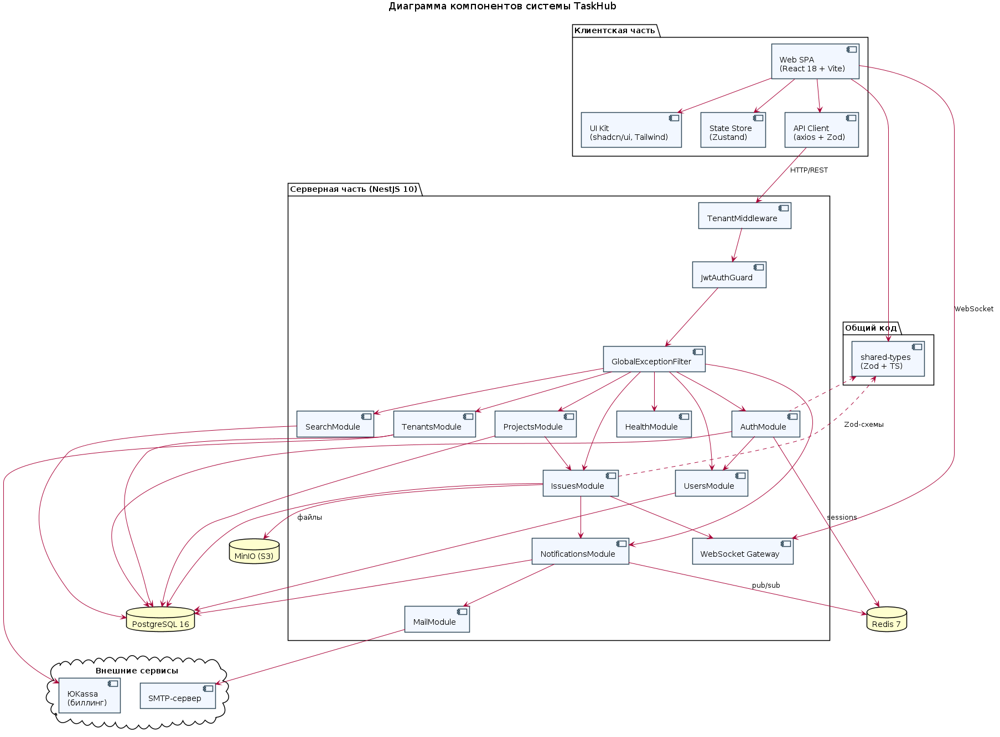{width=78%}

**Стек.** NestJS 10 / TypeScript 5 · React 18 + Vite 5 ·
PostgreSQL 16 · Redis 7 · MinIO (S3) · Socket.IO · Traefik.

**Ключевые решения.** Модульный монолит вместо микросервисов
(быстрая разработка, единая БД); event-driven слой через
`EventEmitter2`; presigned URL для загрузки файлов; refresh-токены
в Redis с детектированием повторного использования.

---

# 1.4 Доменная модель

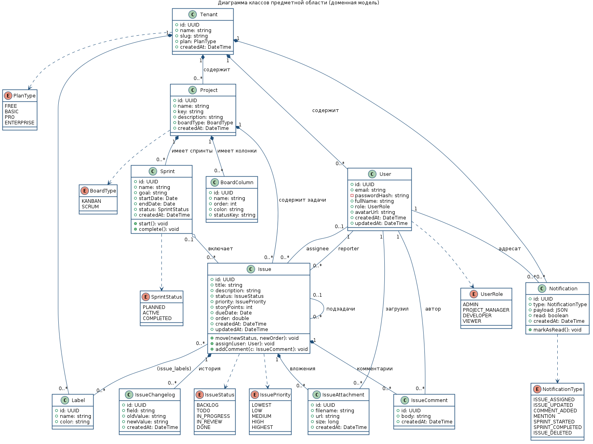{width=68%}

11 классов-сущностей: `Tenant`, `User`, `Project`, `Issue`, `Sprint`,
`BoardColumn`, `Label`, `IssueComment`, `IssueAttachment`,
`IssueChangelog`, `Notification`. Перечисления статусов и приоритетов
вынесены в Enum-ы (`IssueStatus`, `IssuePriority`, `SprintStatus`, …).

---

# 1.5 База данных и Row-Level Security

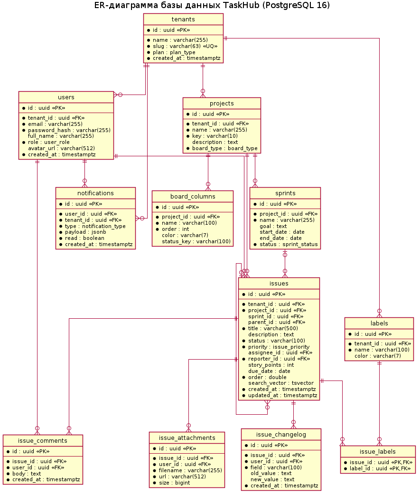{width=72%}

- 11 таблиц, внешние ключи `ON DELETE CASCADE` внутри арендатора;
- `tsvector` + триггер обновления для полнотекстового поиска;
- **RLS-политики на каждой таблице** + `SET app.current_tenant`
  в начале запроса — изоляция арендаторов на уровне СУБД.

---

# 1.6 Варианты использования и паттерны

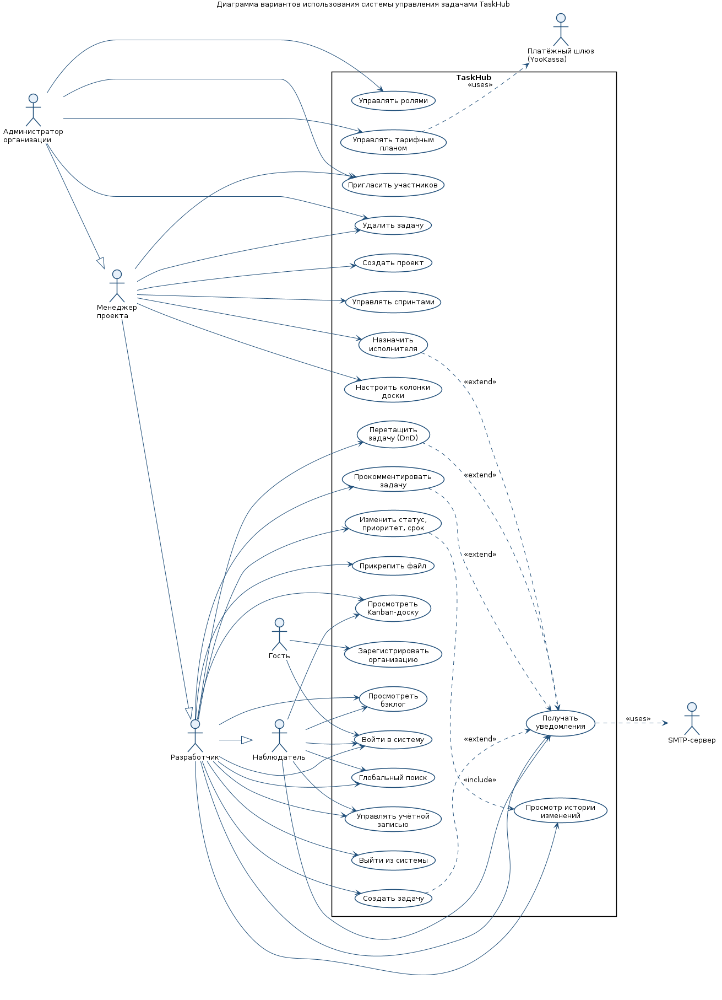{width=58%}

**Применённые паттерны.** Modular Monolith · Repository (TypeORM) ·
DTO + Validation Pipe (Zod) · Event-Driven (EventEmitter2) ·
Strategy (JwtStrategy) · Observer (WebSocket-уведомления) ·
Factory (фабрики уведомлений по типу события).

---

# ГЛАВА 2. РЕАЛИЗАЦИЯ

Структура кода, аутентификация, управление задачами,
real-time, уведомления, развёртывание.

---

# 2.1 Структура исходного кода

**Монорепозиторий**

```
apps/
  api/    NestJS 10  (auth, tenants, projects, issues,
          sprints, boards, comments, attachments,
          notifications, search, billing)
  web/    React 18 + Vite 5 + Tailwind + Zustand
infrastructure/
  postgres/init.sql   схема + RLS
  docker/             Dockerfile-ы
docker-compose.yml    8 сервисов
```

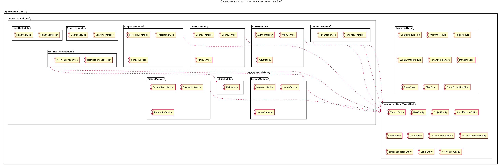{width=55%}

---

# 2.2 Аутентификация: JWT + refresh-rotation

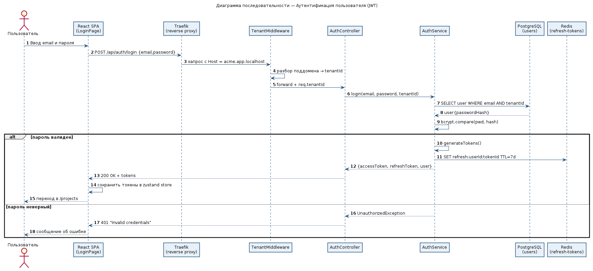{width=70%}

- bcrypt-проверка пароля → выдача access (15 мин) и refresh (30 дней);
- refresh-токен хранится в Redis по идентификатору сессии;
- при обновлении старый токен инвалидируется (rotation);
- повторное использование старого токена → отзыв всей цепочки сессий.

---

# 2.3 Управление задачами и Kanban

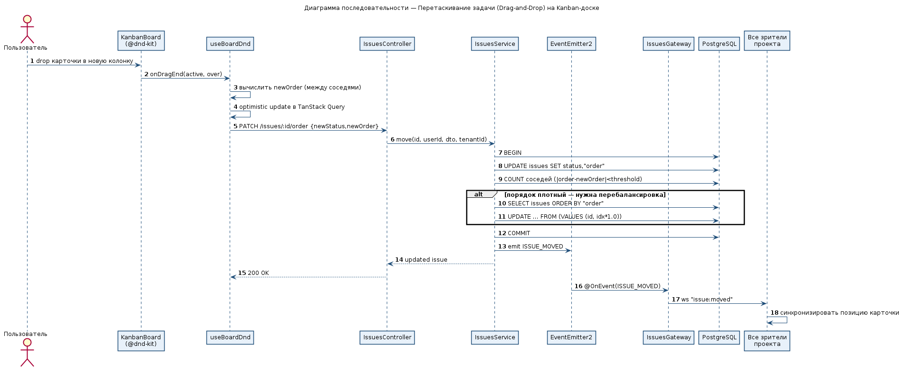{width=72%}

- float-based ordering: `position = (prev + next) / 2`;
- автоматическая ребалансировка при сжатии диапазона;
- запись в `IssueChangelog`, событие `issue.updated`,
  WebSocket-broadcast подписчикам проекта.

---

# 2.4 Жизненный цикл задачи

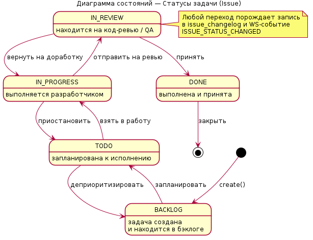{width=46%}
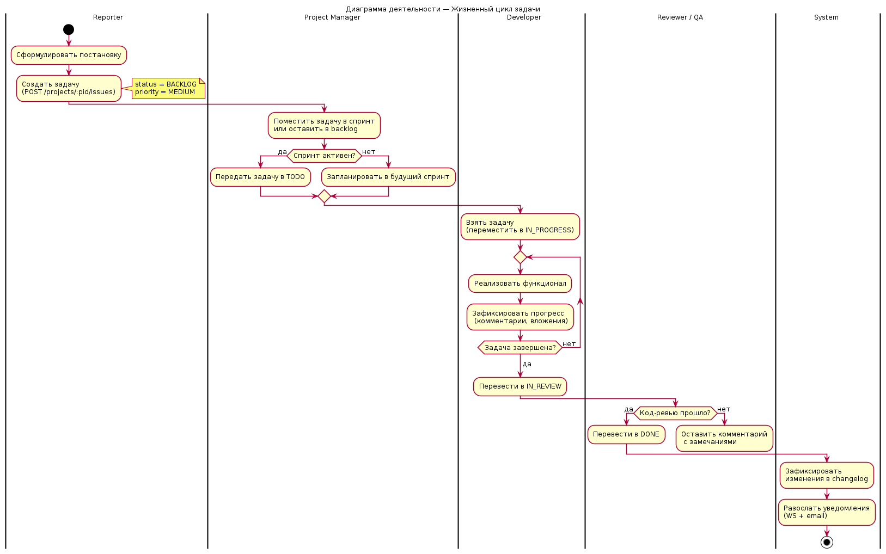{width=42%}

Статусы: `BACKLOG → TODO → IN_PROGRESS → IN_REVIEW → DONE`,
с возможностью возврата в `TODO` и перехода в `CANCELLED`.
Каждый переход фиксируется в `IssueChangelog` и порождает событие.

---

# 2.5 Real-time и уведомления

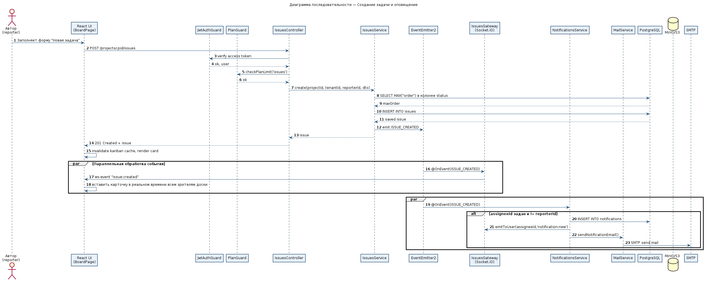{width=70%}

- Socket.IO-gateway, комнаты по `tenantId` и `projectId`;
- 7 типов уведомлений (assigned, mentioned, status_changed, …);
- доставка in-app (WebSocket) + e-mail (SMTP, шаблоны);
- идемпотентная обработка событий через `EventEmitter2`.

---

# 2.6 Развёртывание

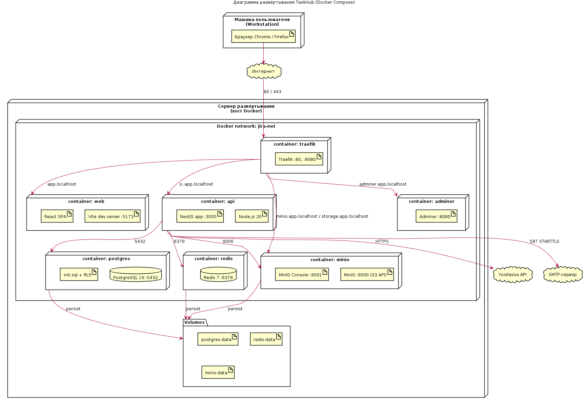{width=78%}

`docker compose up` поднимает 8 контейнеров: Traefik (TLS, маршрутизация),
`web` (Vite preview), `api` (NestJS), PostgreSQL, Redis, MinIO,
Adminer. Конфигурация — через `.env`, секреты не в репозитории.

---

# Заключение и результаты

**Получено**

- спроектирован прототип multi-tenant СУЗ TaskHub;
- реализован REST + WebSocket API на NestJS, web-клиент на React;
- БД с RLS-политиками для изоляции арендаторов;
- 12 UML-диаграмм покрывают use case, классы, ER, поведение,
  компоненты, развёртывание и пакеты.

**Перспективы развития.** Мобильный клиент, AI-ассистент
для оценки задач, интеграции с Git-провайдерами и CI/CD,
переход к event sourcing для аудит-лога.

---

# Спасибо за внимание!

**Готов ответить на вопросы.**

Репозиторий и документ работы — в приложении к курсовой.
